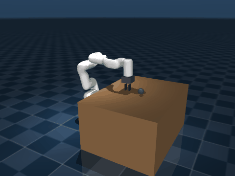

# xArm6 RL + LeRobot Data Collection

MuJoCo 시뮬레이션에서 xArm6 reach 정책을 학습하고, 학습된 정책을 실제 UFactory xArm6에 배포하며, SpaceMouse로 VLA fine-tuning용 LeRobot 포맷 데이터를 수집하는 프로젝트입니다.

## 구성

```text
physical-ai-vanila/
  assets/
    xarm6/                 # xArm6 MJCF/URDF/mesh
    scene_reach.xml
    scene_pick_place.xml
  xarm_rl/
    envs/
      base_env.py
      reach_env.py         # XArm6Reach-v0
      pick_place_env.py
  scripts/
    train.py               # PPO/SAC 학습
    eval_headless.py       # headless 평가
    render_gif.py          # 시뮬 rollout GIF 생성
    demo_grid_tour.py      # 시뮬 9-point grid tour GIF 생성
    deploy_grid_tour.py    # 실제 xArm6 9-point grid tour 배포
    deploy_real.py         # 단일 target 실제 배포
  space_mouse/
    space_telecontrol.py   # SpaceMouse teleop + LeRobot 기록
  outputs/
    reach_ppo_v2/          # PPO baseline 결과
    real_runs/             # 실제 실행 로그
```

## 설치

Windows에서 현재 폴더 구조를 기준으로:

```powershell
cd C:\Users\M207\Desktop\kang\code_factory\physical-ai-vanila

uv venv physical-ai-vanila\.venv --python 3.11
.\physical-ai-vanila\.venv\Scripts\activate

uv pip install -e '.\physical-ai-vanila[real]'
uv pip install pyspacemouse pyrealsense2 opencv-python lerobot
```

학습/평가만 할 때는 `pyspacemouse`, `pyrealsense2`, `opencv-python`, `lerobot`가 없어도 됩니다. 실제 로봇 배포에는 `xArm-Python-SDK`, SpaceMouse 데이터 수집에는 위 네 패키지가 필요합니다.

설치 확인:

```powershell
cd C:\Users\M207\Desktop\kang\code_factory\physical-ai-vanila\physical-ai-vanila

python -c "import mujoco, gymnasium, stable_baselines3, xarm_rl; import gymnasium as gym; e=gym.make('XArm6Reach-v0'); print('env OK', e.reset(seed=0)[0].shape)"
```

`env OK (21,)`가 나오면 시뮬 환경은 정상입니다.

## 학습

Reach 정책 학습:

```powershell
python scripts/train.py --task reach --algo ppo `
  --n_envs 16 `
  --timesteps 1500000 `
  --seed 7 `
  --out outputs/reach_ppo_v2
```

SAC로 학습:

```powershell
python scripts/train.py --task reach --algo sac `
  --n_envs 1 `
  --timesteps 250000 `
  --seed 23 `
  --out outputs/reach_sac_v3
```

출력 구조:

```text
outputs/reach_ppo_v2/
  final_model.zip
  ckpts/
  monitor.csv
  tb/
```

TensorBoard:

```powershell
tensorboard --logdir outputs
```

## 평가

Headless 평가:

```powershell
python scripts/eval_headless.py --task reach --algo ppo `
  --model outputs/reach_ppo_v2/final_model.zip `
  --episodes 50 `
  --out_json outputs/reach_ppo_v2/eval.json
```

평가 JSON에는 다음 값이 저장됩니다.

```text
success_rate
mean_reward
mean_final_dist
mean_ep_len
```

현재 확인된 기준 성능:

| 정책 | 결과 |
|---|---:|
| PPO v2 baseline | 86% success |
| SAC v3 best | 86% success |
| PPO v2 9-point grid tour | 9/9 target 도달 |

## 시뮬 GIF

9-point grid tour GIF 생성:

```powershell
python scripts/demo_grid_tour.py --algo ppo `
  --model outputs/reach_ppo_v2/final_model.zip `
  --out outputs/gif/ppo_v2_grid_tour.gif
```

단일 rollout GIF 생성:

```powershell
python scripts/render_gif.py --task reach --algo ppo `
  --model outputs/reach_ppo_v2/final_model.zip `
  --out outputs/gif/ppo_v2_rollout.gif `
  --episodes 3 `
  --width 480 `
  --height 360 `
  --fps 30
```

시뮬 결과:


| PPO v2 rollout | SAC v3 best rollout |
|---|---|
|  |  |

## 실제 배포

실제 xArm6 실행 전 체크:

- xArm6 controller와 노트북이 같은 네트워크에 있어야 합니다.
- 기본 controller IP는 `192.168.1.199`입니다.
- e-stop을 손에 두고 실행합니다.
- xArm Studio에서 모터 enable, error clear, home 이동이 되는지 먼저 확인합니다.
- workspace safety box는 `x: 0~570 mm`, `y: -540~550 mm`, `z: 180~600 mm` 기준으로 맞춥니다.

통신 확인:

```powershell
python -c "from xarm.wrapper import XArmAPI; a=XArmAPI('192.168.1.199'); print('state=', a.get_state()); print('err_warn=', a.get_err_warn_code()); print('q=', a.get_servo_angle(is_radian=True)); a.disconnect()"
```

실제 9-point grid tour dry-run:

```powershell
python scripts/deploy_grid_tour.py `
  --model outputs/reach_ppo_v2/final_model.zip `
  --dry-run
```

실제 xArm6 실행:

```powershell
python scripts/deploy_grid_tour.py `
  --model outputs/reach_ppo_v2/final_model.zip `
  --home-speed 0.15 `
  --max-step-rad 0.005 `
  --dwell 2.0
```

처음 실제 실행은 `--max-step-rad 0.005`처럼 느리게 시작하고, 안정적으로 확인한 뒤 단계적으로 올립니다.

실제 배포 GIF:


## SpaceMouse로 LeRobot 데이터 수집

`space_mouse/space_telecontrol.py`는 기존 RL 학습/배포 코드와 독립적으로 동작합니다.

동작 방식:

- `--record` 없음: SpaceMouse로 xArm Cartesian velocity 조종만 수행
- `--record` 있음: 같은 루프에서 RealSense wrist RGB, 현재 TCP state, target action을 LeRobotDataset에 저장

조종만:

```powershell
python space_mouse/space_telecontrol.py `
  --ip 192.168.1.199 `
  --fps 10
```

조종 + LeRobot 포맷 기록:

```powershell
python space_mouse/space_telecontrol.py `
  --ip 192.168.1.199 `
  --fps 10 `
  --record `
  --repo-id kangkang9412/xarm6_spacemouse_demo `
  --root ./data/xarm6_spacemouse_demo `
  --task "pick up the object"
```

`--fps 10`은 로봇 조종 속도가 아니라 데이터 저장 주기입니다. 기본 조종 루프는 `--control-hz 30`이라 SpaceMouse 입력과 xArm velocity command는 초당 30회 처리되고, LeRobot frame만 초당 10회 저장됩니다.

저장 feature:

```text
observation.images.wrist   RGB video, uint8, 480x640x3
observation.state          float32[7], current TCP 6D pose + gripper
action                     float32[7], target TCP 6D pose + gripper
task                       add_frame()에 같이 전달되는 task string
```

종료:

- `q` 또는 Ctrl+C: 현재 episode 저장 후 `finalize()`
- `Esc`: 현재 episode buffer 폐기

`lerobot` repo는 inner 프로젝트 안에 넣을 필요가 없습니다. 현재처럼 sibling으로 두면 `space_telecontrol.py`가 `..\lerobot\src`를 먼저 사용하고, 없으면 `.venv`에 설치된 `lerobot` 패키지를 사용합니다.

```text
C:\Users\M207\Desktop\kang\code_factory\physical-ai-vanila\
  lerobot\
  physical-ai-vanila\
    space_mouse\
      space_telecontrol.py
```

## 트러블슈팅

| 증상 | 확인 |
|---|---|
| `ModuleNotFoundError` | `.venv` 활성화 후 설치 명령 재실행 |
| RealSense frame 없음 | USB 연결, Intel RealSense SDK, `pyrealsense2` 설치 확인 |
| SpaceMouse open 실패 | SpaceMouse USB 연결과 3Dconnexion 드라이버 상태 확인 |
| xArm code != 0 | xArm Studio에서 error clear 후 재실행 |
| 실제 동작이 빠름 | `--max-step-rad`, `--home-speed`를 낮춤 |
| MuJoCo headless render 실패 | `MUJOCO_GL=egl` 환경 변수 확인 |

## Credits

- xArm Python SDK: UFactory [xArm-Python-SDK](https://github.com/xArm-Developer/xArm-Python-SDK)
- RL: [Stable-Baselines3](https://stable-baselines3.readthedocs.io/), [Gymnasium](https://gymnasium.farama.org/), [MuJoCo](https://mujoco.org/)
- Dataset format: [LeRobot](https://github.com/huggingface/lerobot)
